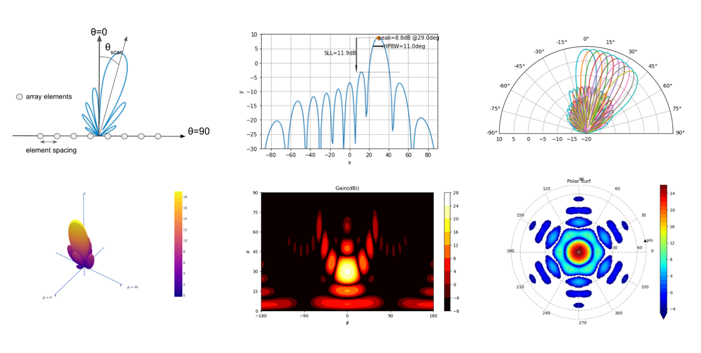

# Python Antenna Array

This repository includes python files and notebooks for analyzing both *linear* and *plananr* `antenna arrays`. 
In particular, antnenn_array.py file includes basic methods to analyze a linear antenna array. You can calculate the __array factor__ (AF), 
plot radiation patterns and find pattern parameters such as Peak value and direction, __HPBW__ and  __SLL__. 

_linear_array.py_ implements a LinearArray class. There you can play with linear arrays as objects and run similar analyses on them. 

_planar_array.py_ as the extension of LinearArray class to the planar case where many interesting array shapes and radiation pattern visualization methods are implemented.

Check out the _Example.py_ or _Examples.ipynb_ for a tutorial. If you are a beginner with Python, you can do most of the basic analysis related to antenna arrays by 
following the examples provided. However, if you want to get fancy and produce some irregular array shapes you need to know a little bit of Python. 

A list of the requirements is given below. If you are not familiar with installing packages or Python itself, save yourself the trouble and just install 
Anaconda distribution (https://www.anaconda.com/download) which comes with those packages installed. 

## Requirements

Requires the latest and great vesions! of the below.
- Python3!
- `numpy` 
- `scipy` 
- `matplotlib` 
- `ipython` 

  

